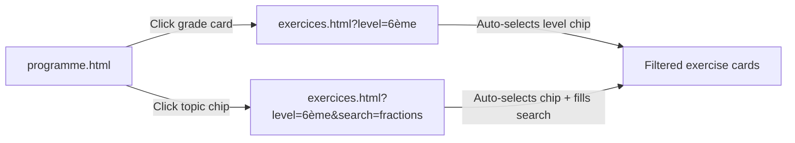

# AppMathConsult — Navigation & Interactivity Roadmap

> Reference sheet for future development sessions.
> Last updated: 13 April 2026

---

## 1. Current State — What Works & What Doesn't

### Page: `programme.html`

| Element | Current Behavior | Status |
|---|---|---|
| **Grade cards** (6ème, 5ème, 4ème, 3ème, Seconde, etc.) | Static `<div>`. Click does nothing. Arrow icon is decorative. | 🔴 Not linked |
| **Topic chips** (Fractions, Géométrie plane, Symétrie axiale…) | Static `<span>`. Click does nothing. | 🔴 Not linked |
| **"Explorer les exercices"** section buttons | Static buttons, no `href`. | 🔴 Not linked |
| Navigation bar links | ✅ All work (Accueil, Programme, Exercices, Ressources, Mon Espace) | 🟢 Working |
| Footer links | ✅ All work (Plan de l'application, Liens utiles, Mentions légales) | 🟢 Working |

### Page: `exercices.html`

| Element | Current Behavior | Status |
|---|---|---|
| **Search bar** | ✅ Filters cards in real-time by text content | 🟢 Working |
| **Level chips** (Tous, 6ème…Bac Pro) | ✅ Click highlights chip and filters cards by `data-level` | 🟢 Working |
| **Type chips** (Tous, Fiche Bristol, Exercices, Devoirs, Devoirs Maison) | ✅ Click highlights chip and filters cards by `data-type` | 🟢 Working |
| **"Accéder" buttons** on cards | Static buttons, no `href`. | 🔴 Not linked |
| **No-results message** | ✅ Displays when filters return no matches | 🟢 Working |
| **URL parameters** (`?level=6ème`) | Not supported — filters don't read URL params on load | 🟡 To implement |

### Page: `ressources.html`

| Element | Current Behavior | Status |
|---|---|---|
| **Search bar** | ✅ Filters cards in real-time | 🟢 Working |
| **Type pills** (Tout, Fiche Bristol, Exercices, Devoirs, Vidéos) | ✅ Click highlights pill and filters cards by `data-type` | 🟢 Working |
| **Level pills** (Tout, Collège, Lycée, Bac Pro) | ✅ Click highlights pill and filters cards by `data-level` | 🟢 Working |
| **"Télécharger PDF" buttons** | Static buttons, no real download | 🔴 Not linked |
| **No-results message** | ✅ Displays when filters return no matches | 🟢 Working |

### Page: `espace-eleve.html`

| Element | Current Behavior | Status |
|---|---|---|
| Profile name & level | ✅ Read-only display from localStorage | 🟢 Working |
| Stats (Exercices, Étude, Favoris) | ✅ Dynamic from localStorage | 🟢 Working |
| Progress bars (Algèbre, Géométrie…) | ✅ Read-only, rendered from localStorage | 🟢 Working |
| Favorites grid | ✅ Read-only, rendered from localStorage | 🟢 Working |
| Activity log | ✅ Read-only, rendered from localStorage | 🟢 Working |
| Quote rotation | ✅ Random quote on each load | 🟢 Working |
| Quick actions (links to other pages) | ✅ All navigate correctly | 🟢 Working |
| **Edit name / Edit avatar / Level selector / Edit progress / Remove favorites / Clear activity** | Removed (deferred for future implementation) | 🟡 Deferred |

### Page: `mentions-legales.html`

| Element | Current Behavior | Status |
|---|---|---|
| All content | ✅ Static legal text from mathconsult-niort.fr | 🟢 Working |
| Footer links | ✅ Consistent with other pages | 🟢 Working |

---

## 2. Proposed Navigation Flow — Programme Drill-Down

The core idea: **Programme → Level → Topic → Filtered Exercises/Resources**



### 2.1 Grade Card Click (e.g. "6ème")

**Current**: `<div class="grade-card">` — static, no link.

**Proposed**: Wrap in `<a>` tag or add `onclick`:
```
Destination: exercices.html?level=6ème
```

**What it does on arrival**:
- JS reads `URLSearchParams` from the URL
- Auto-clicks the "6ème" filter chip (removes "Tous" active state)
- Shows only exercises tagged with `data-level="6ème"`

### 2.2 Topic Chip Click (e.g. "Fractions" in 6ème)

**Current**: `<span class="topic-chip">Fractions</span>` — static.

**Proposed**: Convert to `<a>` tag:
```
Destination: exercices.html?level=6ème&search=fractions
```

**What it does on arrival**:
- JS reads both `level` and `search` params
- Auto-clicks the "6ème" filter chip
- Pre-fills the search bar with "fractions"
- Shows only matching exercises

### 2.3 JS Changes Required (exercices.html)

Add this at the start of the existing filter script:
```javascript
// Read URL params on page load
const params = new URLSearchParams(window.location.search);
const urlLevel = params.get('level');
const urlSearch = params.get('search');

if (urlLevel) {
    // Find and click the matching level chip
    levelGroup.querySelectorAll('.filter-chip').forEach(chip => {
        if (chip.textContent.trim() === urlLevel) chip.click();
    });
}
if (urlSearch) {
    searchInput.value = urlSearch;
    applyFilters();
}
```

### 2.4 HTML Changes Required (programme.html)

**Grade cards** — wrap content in `<a>`:
```html
<!-- Before -->
<div class="grade-card">
    <h3>6ème</h3>
    ...
</div>

<!-- After -->
<a href="exercices.html?level=6ème" class="grade-card block">
    <h3>6ème</h3>
    ...
</a>
```

**Topic chips** — convert `<span>` to `<a>`:
```html
<!-- Before -->
<span class="topic-chip">Fractions</span>

<!-- After -->
<a href="exercices.html?level=6ème&search=fractions" class="topic-chip">Fractions</a>
```

---

## 3. Deferred — Espace Élève Editable Features

These features were built and then removed at user request. They can be restored later.

| Feature | Implementation Notes |
|---|---|
| **Edit name** | `prompt()` dialog, saves to `localStorage.mc_profile.name` |
| **Edit avatar** | Cycles through Material Symbols icons (person, school, face, etc.) |
| **Level selector** | `<select>` dropdown, saves to `localStorage.mc_profile.level` |
| **Edit progress** | Per-topic `prompt()` (0-100), saves to `localStorage.mc_profile.progress` |
| **Remove favorites** | ✕ button on hover, removes from `localStorage.mc_profile.favorites` |
| **Clear activity** | Button to wipe `localStorage.mc_profile.activity` array |

All code is available in git history for re-integration.

---

## 4. Future Considerations

- **"Accéder" / "Accéder aux fiches" buttons** on exercise cards currently go nowhere. They could link to individual chapter detail pages or open a modal with the resource list.
- **"Télécharger PDF" buttons** on resource cards need real PDF files linked.
- **Ressources page** could also support `?type=...&level=...&search=...` URL params for cross-page linking.
- **Index.html** hero CTA buttons ("Accéder aux exercices", "Explorer le programme") should verify they point to the right pages.
